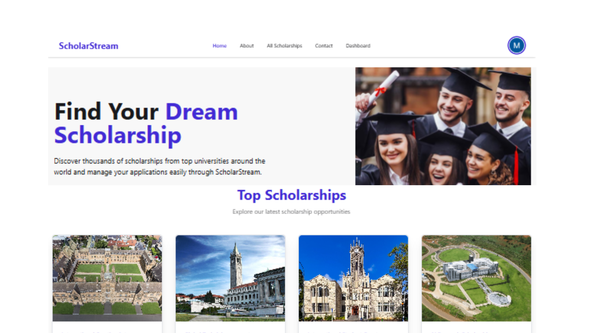
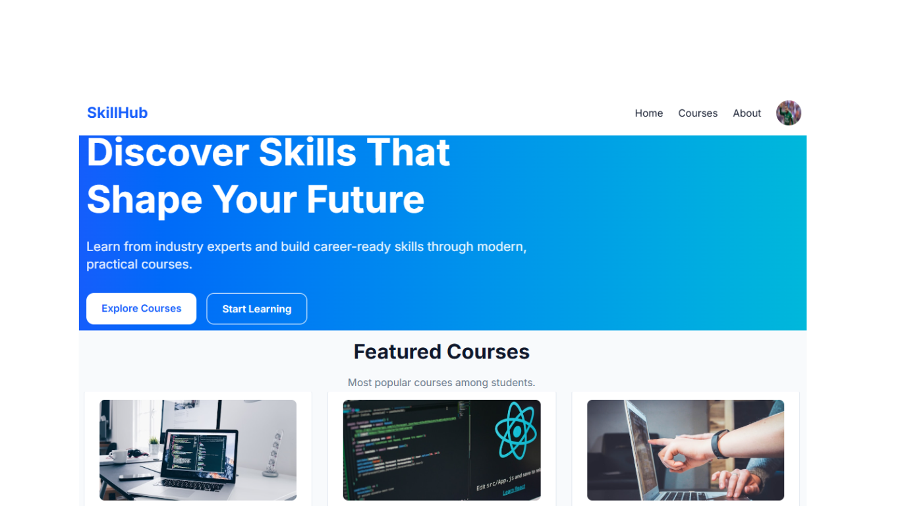
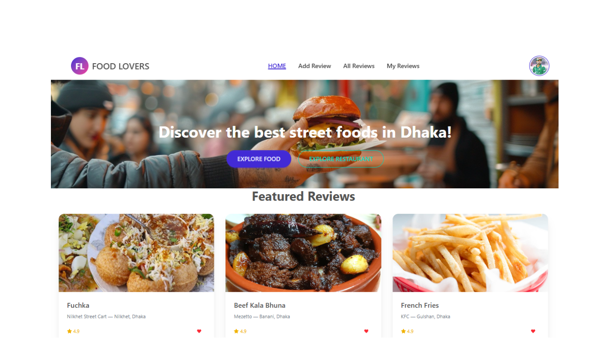

<h1 align="center">Hi 👋, I'm Mohd Imran Hossain</h1>

<h3 align="center">
🚀 Full Stack JavaScript Developer | React.js & Next.js Specialist
</h3>

Passionate about building modern, scalable and user-friendly web applications.

---

## 👨‍💻 About Me

I'm a passionate Full Stack JavaScript Developer with experience in building responsive, modern, and scalable web applications using React.js, Next.js, Node.js, Express.js, and MongoDB.

I enjoy transforming ideas into real-world digital solutions and continuously learning new technologies to improve my development skills.

### 🎯 Career Objective

To contribute as a Frontend or Full Stack Developer in impactful software projects while continuously growing my technical expertise and problem-solving abilities.

---

## 🔥 Currently Working On

* 🚀 Building full-stack applications with Next.js 16
* ⚡ Improving React performance optimization skills
* 🔐 Learning advanced authentication and security practices
* 🏗️ Exploring scalable software architecture patterns
* 🌱 Expanding my portfolio with production-ready projects
* 🤝 Open to collaboration on exciting web development projects

---

## 🛠️ Tech Stack

### Frontend

### Backend

### Database

### Tools & Platforms

---

## 🤝 Connect With Me

---

# 🚀 Featured Projects

---

<table>
<tr>
<td width="50%">

## 🎓 Scholar Stream

Scholarship management platform where students can discover scholarships and submit applications online.

### Tech Stack

React • Firebase • Node.js • Express.js • MongoDB

### Links

🔗 Live Demo:
https://scholar-stream-e2d14.web.app/

📂 Repository:
https://github.com/imuimuimran/scholar-stream-client

</td>

<td width="50%">

</td>
</tr>
</table>
---

<table>
<tr>
<td width="50%">

## 🎓 SkillHub Academy

Modern LMS platform for students, instructors and administrators.

### Tech Stack

Next.js • TypeScript • MongoDB • Tailwind CSS

### Links

🔗 Live Demo:
https://skillhub-academy-iota.vercel.app/

📂 Repository:
https://github.com/imuimuimran/skillhub-academy

</td>

<td width="50%">

</td>
</tr>
</table>
---

<table>
<tr>
<td width="50%">

## 🍽️ Local Food Lovers Network

Community platform for discovering and sharing local food experiences.

### Tech Stack

React • Firebase • MongoDB • Express.js

### Links

🔗 Live Demo:
https://food-lovers-b-12-a-10.netlify.app/

📂 Repository:
https://github.com/imuimuimran/local-food-lovers-network-client

</td>

<td width="50%">

</td>
</tr>
</table>

---

## 📊 GitHub Statistics

---

## 💡 Fun Fact

I enjoy turning ideas into real-world web applications and continuously challenging myself to learn new technologies and best practices in software development.

---

⭐ Thanks for visiting my GitHub profile! Feel free to explore my repositories and connect with me.
