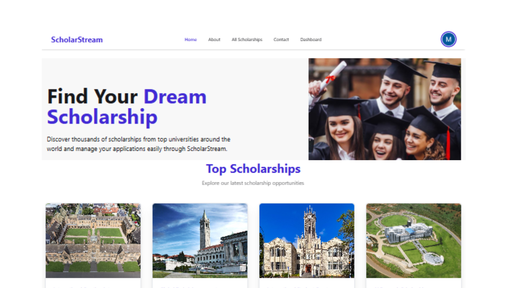
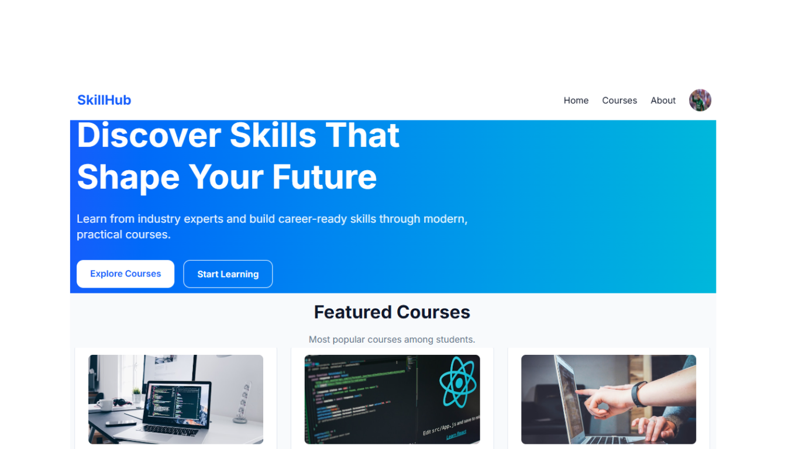
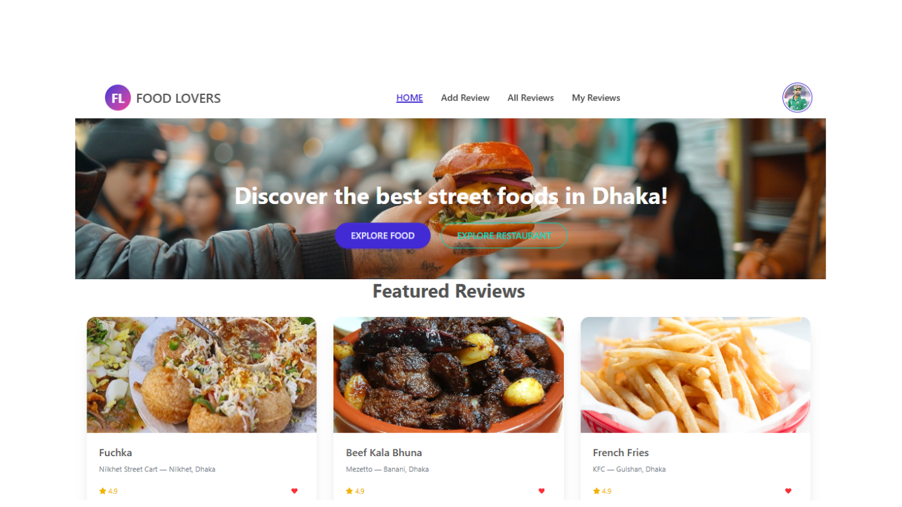

<h1 align="center">Hi 👋, I'm Mohd Imran Hossain</h1>

<h3 align="center">
🚀 Full Stack JavaScript Developer | React.js & Next.js Developer
</h3>

Passionate about building modern, scalable and user-friendly web applications.

---

## 👨‍💻 About Me

I'm a **Full Stack JavaScript Developer** focused on building modern, responsive, and scalable web applications using **React.js, Next.js, TypeScript, Node.js, Express.js, and MongoDB**.

I enjoy turning ideas into practical software products and working across the full development lifecycle — from **UI development and API integration to authentication, database design, role-based access control, and deployment**.

I'm continuously improving my software engineering skills by building real-world projects, exploring better architecture patterns, and learning modern development practices.

### 🚀 Currently Working On

* 🚀 Building production-oriented full-stack applications with **Next.js and TypeScript**
* ⚡ Improving **React performance, reusable component architecture, and state management**
* 🔐 Implementing **authentication, authorization, and role-based access control**
* 🏗️ Exploring **scalable backend architecture and REST API design**
* 🤖 Building and integrating **AI-powered features into web applications**
* ☁️ Learning and applying modern **deployment and production practices**
* 📚 Continuously improving **problem-solving and software engineering fundamentals**
* 🤝 Open to collaborating on interesting **web development and full-stack projects**

### 🎯 What I'm Looking For

I'm currently looking for opportunities where I can contribute as a **Junior Full Stack Developer, MERN Stack Developer, or Next.js Developer**, work with experienced engineers, and continue growing through real-world software development.

---

### 🛠️ Core Technologies

* **Frontend:** React.js, Next.js, TypeScript, JavaScript, Tailwind CSS
* **Backend:** Node.js, Express.js, REST APIs
* **Database:** MongoDB, Mongoose
* **Authentication:** Clerk, Firebase, JWT
* **Tools & Platforms:** Git, GitHub, Postman, Vercel, Render

---

## 🛠️ Tech Stack

### Frontend

### Backend

### Database

### Tools & Platforms

---

## 🤝 Connect With Me

---

# 🚀 Featured Projects

---

<table>
<tr>
<td width="50%">

## 🎓 Scholar Stream

Scholarship management platform where students can discover scholarships and submit applications online.

### Tech Stack

React • Firebase • Node.js • Express.js • MongoDB

### Links

🔗 Live Demo:
https://scholar-stream-e2d14.web.app/

📂 Repository:
https://github.com/imuimuimran/scholar-stream-client

</td>

<td width="50%">

</td>
</tr>
</table>
---

<table>
<tr>
<td width="50%">

## 🎓 SkillHub Academy

Modern LMS platform for students, instructors and administrators.

### Tech Stack

Next.js • TypeScript • MongoDB • Tailwind CSS

### Links

🔗 Live Demo:
https://skillhub-academy-iota.vercel.app/

📂 Repository:
https://github.com/imuimuimran/skillhub-academy

</td>

<td width="50%">

</td>
</tr>
</table>
---

<table>
<tr>
<td width="50%">

## 🍽️ Local Food Lovers Network

Community platform for discovering and sharing local food experiences.

### Tech Stack

React • Firebase • MongoDB • Express.js

### Links

🔗 Live Demo:
https://food-lovers-b-12-a-10.netlify.app/

📂 Repository:
https://github.com/imuimuimran/local-food-lovers-network-client

</td>

<td width="50%">

</td>
</tr>
</table>

---

## 📊 GitHub Statistics

---

## 💡 Fun Fact

I enjoy turning ideas into real-world web applications and continuously challenging myself to learn new technologies and best practices in software development.

---

⭐ Thanks for visiting my GitHub profile! Feel free to explore my repositories and connect with me.
